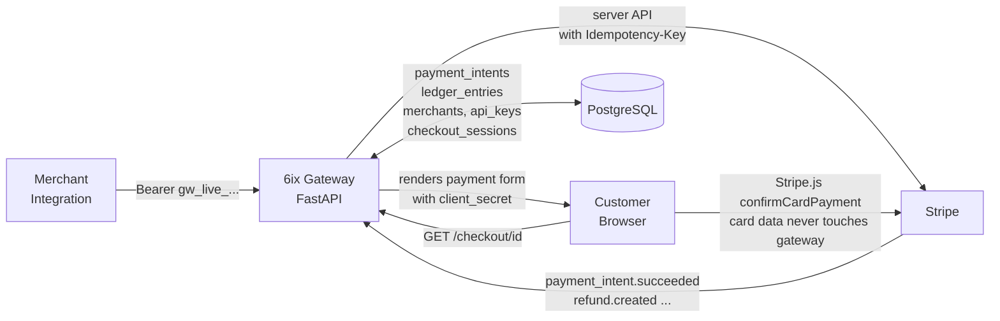

# 6ix Gateway

A multi-tenant payment gateway built on top of Stripe.

## What it does

Sits between merchants and Stripe. Merchants integrate against one API and get:

- **PaymentIntents** — create, confirm, cancel, retrieve. Idempotency keys forwarded to Stripe.
- **Refunds** — full or partial, with double-entry ledger reversal in the same DB transaction.
- **Webhooks** — Stripe events verified via HMAC signature, deduplicated by event id, treated as the source of truth for payment status.
- **Double-entry ledger** — every state change writes a balanced pair of rows. Enforced at write-time by a single service function.
- **Merchant accounts** — each merchant has SHA-256-hashed API keys (raw key shown once at creation). Bearer auth on every mutation.
- **Per-merchant dashboards** — balance, transactions, and per-intent ledger trail — scoped at the SQL layer so one merchant can't see another's data.
- **Reconciliation worker** — pulls yesterday's Stripe balance transactions, diffs against our ledger, persists a `ReconciliationRun` with any drift.
- **Hosted checkout links** — a merchant creates a `CheckoutSession`, hands the customer a public `/checkout/{id}` URL, Stripe.js collects card data directly (never touches our server), the webhook flips the session to `COMPLETED`.

## Architecture



**Request lifecycle for a hosted checkout:**

1. Merchant `POST /checkout-sessions` — gateway creates a PaymentIntent on Stripe (eager), inserts the session, returns a `checkout_url`.
2. Customer opens `/checkout/{session_id}` — gateway serves an HTML page with `client_secret` and publishable key injected as meta tags.
3. Stripe.js in the browser calls `stripe.confirmCardPayment(client_secret, {...})` — the raw card details go straight to Stripe.
4. Stripe fires `payment_intent.succeeded` back to `/webhooks/stripe` — the handler updates the PaymentIntent, writes the ledger transition (`payments_authorised → payments_captured`), and flips the linked CheckoutSession to `COMPLETED`.

## Tech stack

| Layer | Choice |
|---|---|
| Language / runtime | Python 3.11 |
| Web framework | FastAPI |
| ORM | SQLAlchemy 2.0 (fully async, `asyncpg` driver) |
| Migrations | Alembic |
| Database | PostgreSQL 16 |
| Payments | Stripe (server SDK + Stripe.js on the client) |
| Container / deploy | Docker + Docker Compose, deployed on Railway |
| Test runner | pytest + pytest-asyncio (79 tests, in-memory SQLite fixtures) |

## Key engineering decisions

- **Integer cents everywhere.** All monetary amounts are `BigInteger`, never floats or decimals — from the API schema to the ledger to the reconciliation worker. Currency lives in a separate ISO-4217 column. This eliminates float drift as an entire class of bug.
- **Idempotency keys on every mutation.** `create_intent`, `confirm_intent`, `cancel_intent`, `refund_intent`, `create_session` — all require a client-provided key. The gateway short-circuits on replay (same key + same params → same row) and forwards the key to Stripe as the `Idempotency-Key` HTTP header, so the underlying Stripe operation is also idempotent. Same key with different params → 409.
- **Webhooks are the source of truth for payment status.** Nothing polls Stripe. `PaymentIntent.status` only advances past `requires_action` inside the webhook handler. Webhook events are persisted (`webhook_events`) and deduplicated by `event.id` for replay safety.
- **Double-entry ledger, invariant-enforced at write-time.** The `record_transaction` service is the only writer. It refuses unbalanced transactions (`sum(credits) != sum(debits)`), single-leg transactions, and negative amounts — inside the same DB transaction that inserts the rows. Every payment event writes a balanced pair.
- **API keys stored as SHA-256 hashes, looked up by prefix.** Raw key returned exactly once at creation. Verification: (1) reject malformed input before any DB hit, (2) `SELECT * WHERE key_prefix = ?` (indexed lookup), (3) `hmac.compare_digest` per candidate — constant-time, handles prefix collisions correctly. Revoked keys rejected even when the hash matches.
- **Per-merchant scoping enforced in SQL, not just filtered in Python.** Dashboard balance joins through `payment_intents` and applies `WHERE merchant_id = ?`. Transactions endpoint the same. `GET /checkout-sessions/{id}` returns 404 for cross-merchant access — indistinguishable from "doesn't exist" so no existence leak.
- **Enum serialization by value, not name.** `SQLEnum(..., values_callable=lambda e: [m.value for m in e])` on every enum column. SQLAlchemy defaults to serializing enum members by their Python attribute name (uppercase); Postgres enums here are all lowercase. This wiring keeps them consistent — a subtle bug that surfaces only at INSERT time.
- **Structured error responses.** Every error emits `{"error_code", "message", "detail"}` — one taxonomy defined in `app/core/errors.py`, one global exception handler in `main.py`, no per-router `try/except` boilerplate. Domain errors carry both an HTTP status and a machine-readable code.
- **Hosted checkout link expiry is lazy, not swept.** Sessions have a 24h TTL. On any read (`GET /checkout-sessions/{id}` or `GET /checkout/{id}`), a session past its TTL flips to `EXPIRED` in the same request. No cron job / reaper needed. Timezone-tolerant so it works identically against Postgres and SQLite.

## Quickstart

Requirements: Docker, a Stripe account (test mode is enough).

```bash
git clone https://github.com/SamiS3alsadi/6ix-gateway.git
cd 6ix-gateway

# Fill in Stripe keys. STRIPE_API_KEY is your sk_test_...,
# STRIPE_WEBHOOK_SECRET is the whsec_... from `stripe listen` or the dashboard.
cp .env.example .env
$EDITOR .env

docker compose up
```

Migrations run automatically on container boot (`start.sh` → `alembic upgrade head` → `exec uvicorn ...`). The gateway listens on `:8000`.

**Endpoints to hit first:**

```
GET  http://localhost:8000/docs        — OpenAPI reference (auto-generated)
GET  http://localhost:8000/healthz     — liveness probe
GET  http://localhost:8000/checkout    — dev-only checkout page (API key in a form field)
```

**Onboard a merchant and issue a key** (admin-only, uses `X-Admin-Key`):

```bash
curl -X POST http://localhost:8000/merchants \
  -H "X-Admin-Key: $ADMIN_API_KEY" \
  -H "Content-Type: application/json" \
  -d '{"name": "Acme Co", "email": "acme@example.com"}'

# → { "id": "mer_...", ... }

curl -X POST http://localhost:8000/merchants/mer_.../api-keys \
  -H "X-Admin-Key: $ADMIN_API_KEY" \
  -H "Content-Type: application/json" \
  -d '{"name": "production"}'

# → { "key": "gw_live_...", ... }   ← returned exactly once
```

**Run the test suite:**

```bash
pip install -r requirements.txt
pytest tests/
# 79 passed
```

## API overview

| Category | Method | Route | Auth |
|---|---|---|---|
| Payments | `POST` | `/payments/intents` | Bearer |
| | `GET` | `/payments/intents/{id}` | Bearer |
| | `POST` | `/payments/intents/{id}/confirm` | Bearer |
| | `POST` | `/payments/intents/{id}/cancel` | Bearer |
| Refunds | `POST` | `/payments/intents/{id}/refund` | Bearer |
| Dashboard | `GET` | `/dashboard/balance` | Bearer, per-merchant scoped |
| | `GET` | `/dashboard/transactions` | Bearer, per-merchant scoped |
| | `GET` | `/dashboard/transactions/{id}` | Bearer, per-merchant scoped |
| Checkout sessions | `POST` | `/checkout-sessions` | Bearer |
| | `GET` | `/checkout-sessions/{id}` | Bearer |
| Public checkout | `GET` | `/checkout/{session_id}` | none — session id is the capability |
| | `GET` | `/checkout` | none — dev-only page |
| Merchants (admin) | `POST` | `/merchants` | `X-Admin-Key` |
| | `POST` | `/merchants/{id}/api-keys` | `X-Admin-Key` |
| | `GET` | `/merchants/{id}/api-keys` | `X-Admin-Key` |
| | `DELETE` | `/merchants/{id}/api-keys/{key_id}` | `X-Admin-Key` |
| Webhooks | `POST` | `/webhooks/stripe` | Stripe signature |
| Meta | `GET` | `/healthz` | none |

## Version history

| Tag | Contents |
|---|---|
| `v0.6.0` | Phase 5 — hosted checkout sessions, public payment links, webhook wiring to complete sessions |
| `v0.5.0` | Production deployment verified on Railway (schema-migrating start script, PORT autodetect, `postgresql://` → `postgresql+asyncpg://` normalization) |
| `v0.4.0` | Phase 4 — Stripe.js checkout UI served from `/checkout`, full end-to-end payment loop |
| `v0.3.0` | Phase 3 — merchant accounts, SHA-256-hashed API keys, Bearer auth, per-merchant dashboard scoping |
| `v0.2.0` | Phase 2 — refunds, paginated dashboard, Stripe reconciliation worker, structured error taxonomy |
| `v0.1.0` | Phase 1 — payment intents, double-entry ledger, Stripe webhooks, idempotency-key semantics |
